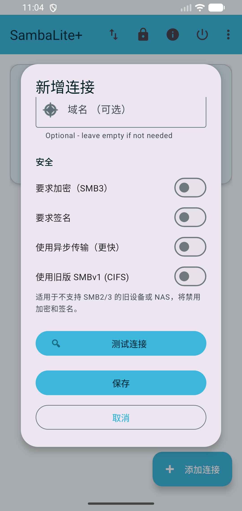
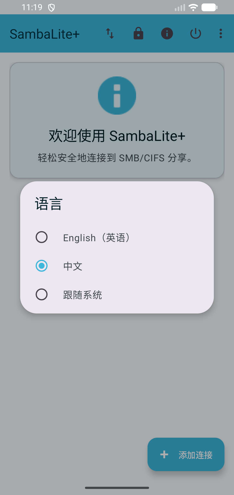

# SambaLite+


## What's New — SMBv1 (CIFS/NT1) Legacy Support

This fork of [egdels/SambaLite](https://github.com/egdels/SambaLite) adds optional **SMBv1 support** via [jcifs-ng](https://github.com/AgNO3/jcifs-ng) for connecting to old NAS devices, Windows XP/Server 2003, and embedded systems that do not support SMB2/3.

- **Explicit per-connection toggle** — a "Use Legacy SMBv1 (CIFS)" switch in the Add/Edit Connection dialog. Existing connections are unaffected; the toggle defaults to off.
- **Full feature parity** — browse, upload, download, delete, rename, create folder, search, folder sync, and transfer queue all work over SMBv1.
- **Zero impact on SMB2/3 paths** — the SMBJ code is completely unchanged. The jcifs-ng backend is only invoked when the toggle is on.
- **Powered by** `eu.agno3.jcifs:jcifs-ng:2.1.10` alongside the existing `com.hierynomus:smbj:0.14.0`.

> **Note:** SMBv1 has known security weaknesses (no encryption, no modern signing). Use it only on trusted local networks and only when the server cannot be upgraded to SMB2/3.

---

SambaLite is a lightweight, modern, and open-source Android client for SMB/CIFS shares (Samba). It provides a minimalistic, reliable, and secure tool for accessing SMB shares on local networks without unnecessary features, ads, or bloat.

**Note:** SambaLite is an independent open-source project and is not affiliated with the official [Samba Project](https://www.samba.org/) or SerNet.  
The name refers solely to the supported SMB/CIFS network protocols.


## Download

Pre-built APKs are available on the [Releases page](https://github.com/ever4Yang/SambaLite-with-smbv1-legacy-support/releases).

| Build | Description |
|-------|-------------|
| [Latest Build](https://github.com/ever4Yang/SambaLite-with-smbv1-legacy-support/releases/tag/latest) | Latest debug APK, updated automatically on every push to `main` |
| [All Releases](https://github.com/ever4Yang/SambaLite-with-smbv1-legacy-support/releases) | Versioned release APKs (e.g. `v2.5.6`) with SHA256 checksums |

**To install:**
1. Download the `.apk` file
2. On your Android device, enable **Settings → Install unknown apps** for your browser or file manager
3. Open the downloaded APK and tap **Install**

## Features

### New in This Fork

| Feature             | Description                                                                 |
| ------------------- | --------------------------------------------------------------------------- |
| Legacy SMBv1 (CIFS) | Optional per-connection toggle for old NAS/devices that don't support SMB2/3 |
| Language Switch     | Switch between English and 中文 (Chinese) from the overflow menu            |

### Original Features

| Feature               | Description                                                                                      |
| --------------------- | ------------------------------------------------------------------------------------------------ |
| SMB/Share Connection  | Connect with username/password and domain                                                        |
| File Browsing         | Navigate through folders and files                                                               |
| Download/Upload       | Transfer files between device and share                                                          |
| Open Files            | Open files directly from the share                                                               |
| Share Files/Text      | Share files and text to SMB shares                                                               |
| Delete/Rename         | Basic file operations with confirmation                                                          |
| Search with Wildcards | Find files using * and ? wildcards                                                               |
| Modern UI             | Material Design with Dark Mode support                                                           |
| Multiple Connections  | Manage multiple shares with custom names                                                         |
| Security/Privacy      | Encrypted credential storage, no telemetry                                                       |
| Folder Sync           | Automatic background sync between device and share ([User Guide](docs/sync_user_guide.md))      |
| Transfer Queue        | Background queuing for uploads and downloads ([User Guide](docs/transfer_queue_user_guide.md))  |

## Screenshots

### SMBv1 (CIFS) Connection Toggle



The "Use Legacy SMBv1 (CIFS)" switch appears at the bottom of the Add/Edit Connection dialog. It is off by default — existing SMB2/3 connections are not affected.

### Language Switch



The language picker dialog with **中文** selected. The welcome screen behind it is already rendered in Chinese ("欢迎使用 SambaLite+").

## Language Switch

The app supports **English** and **中文 (Chinese)**. To change the language:

1. Tap the **⋮** overflow menu in the top-right corner of the main screen
2. Tap **Language** (语言)
3. Select **English**, **中文 (Chinese)**, or **Follow System**

The app restarts immediately and all UI strings update to the selected language. The choice is persisted — it survives app restarts and device reboots.

> **Follow System** uses whatever language Android is set to. If Android is set to Chinese, the app shows Chinese; any other system language falls back to English.


## Technical Details

- **Language:** Java 11+
- **Architecture:** MVVM with Repository pattern
- **Min SDK:** 26 (Android 8.0) · **Compile SDK:** 36

### Dual-Backend Architecture

| Backend | Library | Protocol | When used |
|---------|---------|----------|-----------|
| SMBJ | `com.hierynomus:smbj:0.14.0` | SMB2 / SMB3 | Default (toggle off) |
| jcifs-ng | `eu.agno3.jcifs:jcifs-ng:2.1.10` | SMBv1 (CIFS/NT1) | Toggle on |

The two backends are completely independent. Enabling SMBv1 on one connection never affects another.

### Per-Connection Flag

`SmbConnection.legacySmbV1` (boolean, default `false`) controls which backend is used. It is persisted as `"legacySmbV1"` in JSON — a missing key defaults to `false`, so existing saved connections are automatically backward-compatible.

### Routing

`SmbRepositoryImpl` checks `isLegacy(connection)` at the top of every public method and delegates to `SmbV1Operations` when true. The SMBJ code path is never touched for a legacy connection. The same guard is present in `SearchWorker`, `FolderSyncWorker`, and `TransferWorker`.

### SmbV1Operations (jcifs-ng wrapper)

A fresh `CIFSContext` is built per call with these fixed properties:

```
jcifs.smb.client.minVersion       = SMB1
jcifs.smb.client.maxVersion       = SMB1
jcifs.smb.client.signingPreferred = false
jcifs.smb.client.connTimeout      = 30000  (ms)
jcifs.smb.client.responseTimeout  = 60000  (ms)
```

Authentication: NTLM via `NtlmPasswordAuthenticator`; anonymous credentials when username/password are both empty.

Cancellation: `volatile boolean cancelled` checked inside download/upload byte loops.

**Supported operations:**

| Category | Methods |
|----------|---------|
| Discovery | `listShares`, `listFiles`, `getFileItem`, `fileExists`, `folderExists`, `getRemoteFileSize`, `getRemoteLastModified` |
| File I/O | `downloadFile` (2 overloads), `downloadFileWithProgress`, `uploadFile`, `uploadFileWithProgress`, `readRange`, `readFileBytes`, `uploadFromStream`, `downloadToStream` |
| Folder | `downloadFolder`, `downloadFolderWithProgress` |
| Management | `deleteFile`, `deleteFiles`, `renameFile`, `createDirectory` |
| Search | `searchFilesStreaming` (recursive wildcard walk) |
| Control | `cancelDownload`, `cancelUpload`, `testConnection` |

### Dependencies

| Library | Version | Purpose |
|---------|---------|---------|
| AndroidX + Material Design 1.12 | — | UI components |
| Dagger 2 | 2.51.1 | Dependency injection |
| SMBJ | 0.14.0 | SMB2/3 client |
| jcifs-ng | 2.1.10 | SMBv1 (CIFS/NT1) client |
| slf4j-android | 1.7.36-0 | jcifs-ng logging bridge |
| EncryptedSharedPreferences | — | Secure credential storage |
| BouncyCastle | 1.83 | Forced global to satisfy both SMB libs |

## Building the Project

### Requirements

- **JDK 21** (the project sets `sourceCompatibility = VERSION_21`)
- Android SDK with `compileSdk 36`

On Ubuntu/Debian, install JDK 21 if not already present:
```bash
sudo apt-get install -y openjdk-21-jdk-headless
export JAVA_HOME=/usr/lib/jvm/java-21-openjdk-amd64
```

### Android Studio

1. Clone the repository
2. Open the project in Android Studio
3. Build and run on your device or emulator (`Run > Run 'app'`)

### Command Line

```bash

# Debug APK (installs directly on a device)
export JAVA_HOME=/usr/lib/jvm/java-21-openjdk-amd64
./gradlew assembleDebug

# Output: app/build/outputs/apk/debug/app-debug.apk

# Install via ADB
adb install app/build/outputs/apk/debug/app-debug.apk
```

### Release APK

A signed release build requires the keystore credentials as environment variables or Gradle properties:

```bash
export SIGNING_STORE_PASSWORD=<password>
export SIGNING_KEY_ALIAS=<alias>
export SIGNING_KEY_PASSWORD=<password>

./gradlew assembleRelease
# Output: app/build/outputs/apk/release/app-release.apk
```

Unsigned release builds (e.g. for F-Droid) are produced automatically when the signing variables are absent.

## Security Notes

- Credentials are stored securely using Android's Keystore system
- No unencrypted storage of sensitive data
- Minimal permissions required (only network and user-selected storage access)
- Be cautious when using SMB in public or untrusted networks

**Privacy notice:** SambaLite processes all data locally on your device.  
No personal data is transmitted to the developer or any third parties.


## License

This project is licensed under the Apache License 2.0 - see the LICENSE file for details.

## Third-Party Libraries

This project uses the SMBJ library (com.hierynomus:smbj), version 0.14.0, for SMB2/3 client functionality.

SMBJ is licensed under the Apache License, Version 2.0.
For more information, see: https://github.com/hierynomus/smbj

Copyright (c) 2016-2024 Michael N. Heronimus

Licensed under the Apache License, Version 2.0 (the "License");
you may not use this file except in compliance with the License.
You may obtain a copy of the License at

    http://www.apache.org/licenses/LICENSE-2.0

Unless required by applicable law or agreed to in writing, software
distributed under the License is distributed on an "AS IS" BASIS,
WITHOUT WARRANTIES OR CONDITIONS OF ANY KIND, either express or implied.
See the License for the specific language governing permissions and
limitations under the License.

This project also uses the jcifs-ng library (eu.agno3.jcifs:jcifs-ng), version 2.1.10, for optional SMBv1 (CIFS/NT1) legacy support.

jcifs-ng is licensed under the GNU Lesser General Public License, Version 2.1.
For more information, see: https://github.com/AgNO3/jcifs-ng

## Disclaimer / Limitation of Liability

This software is provided "as is", without warranty of any kind, express or implied, including but not limited to the warranties of merchantability, fitness for a particular purpose, and noninfringement. In no event shall the authors or copyright holders be liable for any claim, damages, or other liability, whether in an action of contract, tort, or otherwise, arising from, out of, or in connection with the software or the use or other dealings in the software.

Where not permitted by applicable law (e.g. in cases of gross negligence or intent), this limitation of liability may not apply. Users utilize this software at their own risk.

